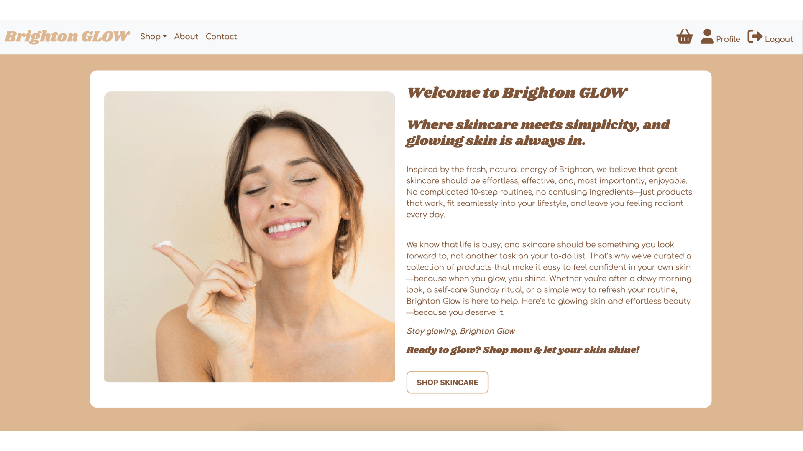

# BrightonGLOW

[View Live Project](https://brightonglow-a60ca67bc04b.herokuapp.com/)

1. [About the Project](#about-the-project)
2. [Agile Framework and Planning](#Agile-Framework-and-Planning)
3. [Features](#features)
4. [User Journey] (#user-journey)
5. [Payments and Stripe Integration](#payments-and-stripe-integration)
6. [Authentication and User Management](#Authentication-and-User-Management)
7. [Database and Data Management](#Database-and-Data-Management)
8. [Deployment](#Deployment)
9. [Testing](#Testing)
10. [Bugs & Debugging Process](#Bugs-&-Debugging-Process)
11. [Marketing & SEO](#Marketing-&-SEO)
12. [Future Features](#Future-Features)
13. [References & Credits](#References-&-Credits)

## About Brighton Glow
Brighton Glow is an online skincare website offering a curated selection of skincare products, inspired by the fresh and natural vibe of Brighton. Their goal is to make it easy for people to find skincare products that help them feel confident and look their best. They believe in keeping things simple and accessible, offering products that fit into your everyday routine and leave your skin glowing.

Customers can browse products by category (moisturisers, serums, masks, gift sets, etc.), filter by skin type, and add multiple products to their shopping bag. The platform provides a seamless check-out experience powered by Stripe, allowing secure transactions using webhooks. Registered users can log in to view their orders and update their details.

The site is built using Django and deployed via Heroku, utilising MySQL as the database and AWS for media storage.

### BrightonGLOW Visuals and Features

Featured Products on the home page which choose 3 products from the catalogue at random.

Information image and text blurb on the homepage, with a review and clickable link (CTA) to shop skincare.

Footer, displaying on all pages. Includes navigation to view pages from the nav bar, sign up to an email newsletter and visit social pages.

NavBar with dropdown menu for shop categories and shop all products. NavBar links to contact and about pages. Plus shopping bag icons, login and register icons. Changes to Profile and Logout if user is authenticated.

All products page displaying all products in the shop, filter by skin type or search for a product name or type.

On the All Products page, there is a filter for Skin Types where you can filter products best for your skin type.

Product detail pages, displaying skin care type, description and price. Buttons to add more 1 or more products to your shopping bag.

Product categories, including moisturisers, serums and masks.

Shopping bag, listing all the products added to the bag ready for checkout. Delete, add and remove products.

Checkout Page for payment and shipping information.

About Us Page, with another featured products pop up for CTA.

Contact Us page including a contact form to ask for help or submit a question. 

#### Branding
BrightonGlow’s branding is warm, modern, and minimal, with the use of white backgrounds enhancing the contrast of rich brown tones, creating a clean and natural feel. The use of rounded edges throughout the design adds softness and approachability, reinforcing a welcoming user experience. Typography is a key part of the brand identity—Shrikhand gives the titles a retro but warming feel, while Comfortaa keeps body text easy to read and visually balanced.

Product photography is simple and uncluttered, ensuring the focus remains on the products themselves. Images feature a diverse range of skin types, ages, and backgrounds, reflecting inclusivity and making the brand accessible to all.

The overall design is intentional and refined, combining subtle details with a clean layout to create a premium yet user-friendly experience.

#### Colour Pallette
Colour pallette used for Brighton GLOW, created by Coolers.co website

# Agile Framework and Planning

To manage my project efficiently, I implemented an Agile development process using GitHub Projects and Issues.

- User Stories & Acceptance Criteria: Each functionality was broken down into User Stories, ensuring clear objectives and usability.

- Prioritisation: Stories were assigned labels such as "Must Have", "Should Have", and "Nice to Have" to focus on the most crucial features first.

- Kanban Workflow: I created a 3-stage board:
To Do – Newly created tasks.
In Progress – Actively being developed.
Done – Completed and tested tasks.

- Automated Tracking: When a new issue was linked to the Brighton Glow Project, it automatically moved into the To Do section. As work progressed, I manually updated its status.

### Examples of User Stories:

##### Front-End: Checkout (Must Have)
As a user, I want to pay for my selected items so that I can complete my purchase.

Acceptance Criteria:

A checkout page displays a summary of the shopping bag and a form for entering payment and shipping details.
Payments are processed securely using Stripe, and the user is shown a confirmation message upon success.

##### Front-End: User Authentication (Must Have)
User Authentication
As a user, I want to create an account and log in.

Acceptance Criteria:

Registration and login pages are functional and validate user input.
Logged-in users see a logout button in the navigation bar.

## Wireframes

# User Journey

## User Registration & Profile Setup
- Users register for an account by providing a username, email, and password.
- Helpful alerts guide users through password requirements and notify them of any errors, such as duplicate email addresses.
- Upon successful registration, users are redirected to their profile page, where they can update personal details, including their full name, email, and address.

## Browsing & Shopping Experience
- Users can browse the store through various filters: categories, search bar, or skin type selection.
- Products can be added to the shopping bag, with the option to increase or decrease quantities, remove items, or continue shopping.
- Pop up alerts will show when an item is added to the shopping bag, showing the item detail and a link to view the bag.

## Checkout & Payment
- When the user proceeds to checkout, the user is directed to a secure stripe payment display.
- The email address auto-fills for logged-in users.
- The order summary displays selected products, total price, and shipping fees.
- Users enter their shipping details and card information and processes through secure payment.

## Order Confirmation & Management
- After payment is approved, users receive are directed to display an order confirmation listing their order ID, item details, and a success message.
- Users will also recieve an email with their order details included.
- The shopping bag automatically clears, and users can choose to return to their profile to view their orders or go back to the homepage.

## Order Tracking & Admin Updates
- Users can track their order history and order status within their profile.
- Admins, staff, or superusers can update the order status on the backend admin panel, which is reflected in the user’s profile (e.g., Processing, Shipped, Delivered).

## Order Cancellations & Guest Checkout
- If a user starts checkout but presses back after entering card details or exits Stripe, the order is automatically marked as cancelled.
- However, if the user simply deletes items from their shopping bag, no order is recorded.
- Cancelled orders remain visible in the profile to confirm no payment was processed.
- Users can continue making purchases, with each new order appearing in their profile.
- Guest checkout is available, but orders will not be saved to an account.

# Features

## E-Commerce Functionalities
#### - Browse Products by Category: Users can explore skincare products categorised into serums, masks, gift sets, and more.

This function retrieves all products within a specific category, which have been uploaded with a category and managed through Django Admin, and displays them on the category detail page.

      def category_detail(request, category_name):
          """Displays products belonging to a specific category."""
          
          category = get_object_or_404(Category, name=category_name)
          products = Product.objects.filter(category=category)
      
          return render(request, 'products/category_detail.html', {
              'category': category,
              'products': products
          })
  
#### - Filter Products by Skin Type: Users can refine their search by selecting products suited for oily, dry, combination, or sensitive skin.

#### - Search for products by name or product type. Using MySql database to enhance search functionality to include the product description.

#### - Shopping Bag & Checkout: Users can add multiple items to their shopping bag, modify quantities, and proceed to a secure checkout using Stripe.

This function adds a product to the shopping bag, updates the total price, and saves the data in the session. It retrieves the product by its ID, gets the selected quantity (defaulting to 1 if not specified), and then updates the bag before redirecting to the shopping bag detail page.

      def add_to_bag(request, product_id):
          """Adds a product to the shopping bag and updates total price."""
          
          bag = Bag(request)
          product = get_object_or_404(Product, id=product_id)
          quantity = int(request.POST.get('quantity', 1))  
      
          bag.add(product=product, quantity=quantity)
          request.session['total'] = bag.get_total_price()
      
          return redirect('bag_detail')

This JavaScript element enables users to increase or decrease the product quantity before adding it to their shopping bag. 

        

#### - Order History: Registered users can log in to view their order history. They can track the status of their order, including options such as, processing, shipped and delivered.

The Profile view function retrieves and displays the user's profile and order history, ensuring only logged-in users can access it by using the @login_required decorator; it filters the Order model to fetch only the logged-in user's orders, excludes those with a "PENDING" status, sorts them by most recent first, and passes the data to the profile.html template for rendering.

      @login_required
      def profile(request):
          """Displays the user's profile and order history."""
          orders = Order.objects.filter(user=request.user).exclude(status="PENDING").order_by('-  created_at')
          return render(request, 'accounts/profile.html', {'orders': orders})

## Authentication & User Accounts
#### - User Registration & Welcome Email: New users can create a free user account and they will receive an automatic email upon signing up, welcoming them to BrightonGLOW.

I set up Django’s built-in email service using Gmail’s SMTP server by configuring the necessary settings in settings.py, allowing the system to automatically send a welcome email to new users upon registration, ensuring they receive a confirmation message from brightonglowskincare@gmail.com as soon as their account is created.

        def register(request):
            """Handles user registration and sends a welcome email."""
            if request.method == 'POST':
                form = CustomUserCreationForm(request.POST)
        
                if form.is_valid():
                    email = form.cleaned_data.get('email')
        
                    # Check for duplicate email
                    if Customer.objects.filter(email=email).exists():
                        messages.error(request, "A user with that email already exists. Please use a different email.")
                        return render(request, 'accounts/register.html', {'form': form})
        
                    # Create user
                    user = form.save()
                    Customer.objects.create(user=user, email=email)
                    login(request, user)
        
                    try:
                        send_mail(
                            'Welcome to BrightonGlow!',
                            'Thank you for registering! Visit our website to explore our full range of skincare!',
                            'brightonglowskincare@gmail.com',
                            [email],
                            fail_silently=False,
                        )

#### - Login & Logout: Users can log in to access their profile, order history, and profile information.

#### - Role-Based Access: There are two user types: Customers (regular users) and Admin/Staff/Superusers (who can manage products and orders).

#### - Conditional Navbar: The navbar dynamically updates depending on whether the user is logged in or out.

## Payments & Checkout
#### - Stripe Integration: Customers can securely pay for their orders using Stripe Payments.

This function creates a Stripe checkout session, specifying payment details, shipping options, and metadata, including the order ID, before redirecting the user to Stripe for secure payment processing.

        # Create Stripe checkout session
        session = stripe.checkout.Session.create(
            payment_method_types=['card'],
            mode='payment',
            currency="gbp",
            line_items=line_items,
            metadata={'order_id': order.id},
            customer_email=email if email else None,
            shipping_address_collection={"allowed_countries": ["GB"]},
            shipping_options=[{
                "shipping_rate_data": {
                    "display_name": "Standard Shipping, 2-3 Working Days",
                    "type": "fixed_amount",
                    "fixed_amount": {"amount": 300, "currency": "gbp"}
                }
            }],
            success_url=request.build_absolute_uri(reverse('payment_success')),
            cancel_url=request.build_absolute_uri(reverse('payment_cancel')),
        )

        order.stripe_payment_intent = session.id
        order.save()

#### - Webhook Handling: Stripe webhooks are used to validate payments and update order status in real-time.

#### - Bootstrap Toast Message appears on the top of the screen when a user adds an item to their shopping bag. 

#### - Order Confirmation: Users receive an order confirmation email after a successful purchase.

#### - Guests can checkout and pay with stripe as a guest, or a logged in user. The email address box is pre-filled when the user is logged in and is required to input when the customer is checking out as a guest.

This part of the checkout function checks if the user is logged in and includes their email if available; if not, it allows them to check out as a guest without an account.

        def checkout(request):
            """Handles the checkout process and creates a Stripe session."""
            
            total = float(request.session.get('total', 0))
        
            if not isinstance(total, (int, float)) or total <= 0:
                return redirect('payment_error')
        
            try:
                bag = Bag(request)
                user = request.user if request.user.is_authenticated else None
                email = request.user.email if request.user.is_authenticated else None

## CRUD Functionality

Logged-in users have full CRUD (Create, Read, Update, Delete) functionality for managing their shopping experience and account details. For example:

#### Create: Users can add products to their shopping bag, create an account, and place orders.

#### Read: Users can browse product details, filter by category or skin type, and view their order history in their profile.

#### Update: Users can edit their account details, adjust product quantities in their shopping bag, and update their shipping information before checkout.

#### Delete: Users can remove items from their shopping bag or request order cancellations (if applicable).

Only admin users have enhanced privileges, such as adding, editing, or deleting products, managing orders, and accessing the Django admin panel to oversee customer transactions.

## Bootstrap 

I used Bootstrap throughout the project to create a responsive, structured, and visually consistent website. Below are the key ways Bootstrap was implemented:

- Navbar: A sticky, responsive navigation bar that collapses on smaller screens and dynamically updates based on user authentication.
- Grid Layout: The Bootstrap grid system (col-md-*) ensures product listings and layouts adjust for different screen sizes.
- Modals: Used for viewing order details without leaving the page.
- Alerts & Messages: Bootstrap alert components provide feedback for actions like user registration and form validation.
- Buttons & Forms: Styled with Bootstrap’s btn and form-control classes to maintain consistency.

#### Example: Bootstrap Modal for Order Details

 

# Payments and Stripe Integration

I intregated Stripe into the website, which ensures customers can seamlessly checkout using card payments while maintaining security through webhooks and API keys.

### 1. Setting Up Stripe API Keys

Environment Variables (.env) store sensitive Stripe credentials:
STRIPE_SECRET_KEY=your_secret_key
STRIPE_PUBLIC_KEY=your_public_key
STRIPE_WEBHOOK_SECRET=your_webhook_secret

These keys are loaded in settings.py:

STRIPE_SECRET_KEY = os.getenv('STRIPE_SECRET_KEY')
STRIPE_PUBLIC_KEY = os.getenv('STRIPE_PUBLIC_KEY')
STRIPE_WEBHOOK_SECRET = os.getenv('STRIPE_WEBHOOK_SECRET')

### 2. Checkout Process

When a user proceeds to checkout:

- A total order price is retrieved from the session.
- A new order is created in the database (Order model).
- The shopping bag items are converted into Stripe line items.
- A Stripe Checkout Session is created:

            session = stripe.checkout.Session.create(
                payment_method_types=['card'],
                mode='payment',
                currency="gbp",
                line_items=line_items,
                metadata={'order_id': order.id},
                customer_email=email if email else None,
                success_url=request.build_absolute_uri(reverse('payment_success')),
                cancel_url=request.build_absolute_uri(reverse('payment_cancel')),
            )
The user is then redirected to Stripe’s payment page.

### 3. Webhook for Payment Confirmation

- Stripe sends a webhook event when payment is successful.

The webhook view:
- Validates the event using the Stripe Webhook Secret.
- Extracts the order ID and updates its status to "PAID".
- Sends an email confirmation to the customer.

            if event["type"] == "checkout.session.completed":
                session = event["data"]["object"]
                order_id = session.get('metadata', {}).get('order_id')
                order = Order.objects.get(id=order_id)
                order.status = "PAID"
                order.save()

### 4. Handling Order Completion & Errors
- Success Page: Clears the shopping bag after a successful payment.
- Cancel Page: Marks the order as "CANCELLED" if the user leaves checkout.
- Error Handling: If checkout fails, the user is redirected to an error page.

# Authentication and User Management
BrightonGlow uses Django’s built-in authentication with a custom Customer model for storing user details like phone, address, and email.

## User Registration & Profiles
- CustomUserCreationForm ensures email is required during signup.

The register view:
- Prevents duplicate email registrations.
- Logs in users automatically after signup.
- Sends a welcome email upon successful registration.
- Users can update their profile details (phone, address) via CustomerProfileForm.
- The update_profile view ensures only logged-in users can update their profiles (@login_required).
- Customer Model is linked to the User model via a OneToOneField, allowing each user to have a detailed profile.
- Users can update their phone number, address, and email using CustomerProfileForm

## Order History & Access Control
- The profile view displays completed orders, ensuring only logged-in users can access their data.

Role-based access:
- Customers manage their profile & orders.
- Admin/Staff manage products & customer orders.
- Dynamic Navbar updates based on login status.

# Database and Data Management

BrightonGlow uses MySQL as its primary database to store and manage essential project data, including users, products, orders, and customer details. 

During development, MySQL was configured locally, and Django was connected to it through the DATABASES settings in settings.py. Migrations were used (makemigrations and migrate) to define and structure the database tables properly. This ensured that user authentication, product storage, and order management functioned well.

For deployment on Heroku, I needed to use JAWSDB MySQL, a cloud-based database add-on that allows MySQL to be hosted within Heroku. The settings.py file was updated to retrieve the database URL dynamically from Heroku’s environment variables, ensuring a good connection between the app and the database in production. Before switching databases, I backed up my product data to prevent any data loss.

## AWS Image Storage

To store and manage images efficiently, I used AWS S3 for the product images, ensuring they remained accessible after deployment. Following the Code Institute PDF guides, I set up the AWS S3 bucket, applied the correct policies, and configured permissions for secure image storage. For general static files like CSS and JavaScript, I used Whitenoise, which helps serve them within the Django app.

- AWS S3 stores product images separately from the application to prevent data loss on deployment.
- Static files (CSS, JS) are handled using Whitenoise to improve site performance.
- Django settings were updated to configure MEDIA_URL for product images and STATIC_URL for site assets.

# Deployment

### Set Up My Project Locally:
- I made sure my Django app was fully functional and working locally.
- Installed necessary libraries like gunicorn, dj-database-url, and whitenoise and added them to requirements.txt.
- Created a Procfile to specify how Heroku should run my app, e.g., web: gunicorn <my_project_name>.wsgi.

### Prepare My App for Heroku:
- Ensured heroku was installed on gitpod, using the command 'Install heroic brew tap heroku/brew && brew install heroku'
- Configured STATIC_ROOT and integrated Whitenoise to manage static files in settings.py.
- Updated DATABASES to use dj_database_url to parse Heroku’s DATABASE_URL.
- Checked that ALLOWED_HOSTS included Heroku’s domain.

### Deploying to Heroku
Once my app was prepared, I deployed it to Heroku by creating an app and linking it to my GitHub repository. I ensured that my Heroku app was set to the EU region for better performance.

To store my database on Heroku, I added the JAWSDB MySQL add-on, which allowed my MySQL database to work with Heroku’s environment. I then updated my DATABASES settings in settings.py to use the JAWSDB_URL from my Config Vars.

I also set up environment variables on Heroku to store sensitive information securely. This included:

- SECRET_KEY (for Django security)
- STRIPE API KEYS (for payments)
- STRIPE WEBHOOK SECRET (to validate Stripe responses)
- EMAIL HOST CREDENTIALS (for sending confirmation emails)

### Pushing to Heroku & Running Migrations
After configuring everything, I pushed my code to Heroku using:

- git push heroku main to deploy the latest version
- heroku run python manage.py migrate to apply database migrations

To avoid static file errors during deployment, I temporarily disabled collectstatic using DISABLE_COLLECTSTATIC=1 in Heroku’s Config Vars until I properly handled static files.

### Checking for Errors & Logs
If any issues occurred, I used Heroku logs to debug errors and ensure my app was running smoothly:

- heroku logs --tail to monitor real-time logs

# Marketing and SEO

I created a Facebook page for Brighton GLOW to enhance brand visibility and engage with potential customers. This allows me to share updates, promotions, and skincare tips while directing traffic to the website, ultimately improving customer engagement and brand trust. 

[View Facebook Page](https://www.facebook.com/brightonglowskincare/)

To maximise email sign-ups, I integrated Mailchimp by creating a subscription form directly on Mailchimp and embedding the provided code into the footer of my website. This ensures users can sign up from any page, increasing engagement. Mailchimp automatically stores and manages subscriber data while ensuring compliance with GDPR and email marketing regulations.

For SEO and metadata implementation, I integrated dynamic meta tags within my Django templates to enhance search engine visibility and improve user engagement. In base.html, I set up core keywords and a meta description that apply to every page. Additionally, I used block super in specific templates to extend and customise metadata for each product while keeping essential branding terms consistent. This ensures search engines recognise unique, relevant keywords for each page while maintaining a strong brand identity.

To determine the best SEO keywords, I conducted market research on competing skincare brands, analysing their product descriptions and common search terms. I then curated a list of high-ranking, relevant keywords that align with Brighton GLOW’s products and target audience, ensuring better discoverability on search engines.

### SEO Implementation in Code:
Using Django template blocks, I dynamically generate SEO-friendly titles and metadata:

            {{ product.name }} | Brighton GLOW Skincare
            
            
            Hydrate and nourish your skin with Brighton GLOW’s {{ product.name }}. 
            Infused with natural ingredients for deep hydration, lasting glow, and effortless beauty.
            
            
             {{ block.super }}
            {{ product.name }}, skincare benefits, hydrating moisturiser, natural ingredients, glowing skin, simple skincare
            
            
### Custom Page Titles: Dynamically updates the <title> tag for each product, boosting SEO rankings.
Meta Descriptions: Provides a brief, engaging summary of each product to improve click-through rates from search results.
Keyword Optimisation: Maintains core keywords while expanding product-specific terms to reach a broader audience.
Newsletter Email Sign-Up (Mailchimp)
To maximise email sign-ups, I integrated Mailchimp by creating a subscription form directly on Mailchimp and embedding the provided code into the footer of my website. This ensures users can sign up from any page, increasing engagement. Mailchimp automatically stores and manages subscriber data while ensuring compliance with GDPR and email marketing regulations.

### Privacy Policy for GDPR Compliance
To comply with GDPR regulations, I created a Privacy Policy, which is accessible as a page on the website from the website footer or downloadable as a PDF. This document outlines how user data is collected, stored, and used, ensuring transparency and building trust with customers.

### Robots.txt & Sitemap
I have successfully set up a robots.txt file to control how search engines crawl my website. This helps prevent irrelevant or sensitive pages, such as the admin panel, user profiles, and checkout pages, from being indexed while ensuring that essential content remains accessible to search engines.

Additionally, I have created and linked a sitemap to Google Search Console, ensuring that all important pages are easily discoverable and indexed. By submitting the sitemap, I have improved the site's SEO visibility and made it easier for Google to crawl and understand the structure of my website.

## Marketing Strategy 

Brighton Glow is a modern, accessible, and premium skincare brand inspired by Brighton’s fresh, natural vibe. It focuses on effortless skincare solutions for those who want a simple yet effective routine.

### Target Audience
Skincare enthusiasts seeking high-quality yet simple products, individuals looking for inclusive, accessible skincare. Online shoppers who appreciate minimalist aesthetics & curated selections and gift buyers looking for thoughtful, premium skincare sets. Age ranges between 20 - 60, female led.

### Marketing Channels

#### Social Media (Facebook, Instagram, TikTok, Pinterest)
- Aesthetic content: Minimalist product shots, skin glow transformations, and "before & after" comparisons
- Educational posts: Skincare tips, ingredient spotlights, and routine guides
- UGC & Influencer Partnerships: Work with micro-influencers & skincare lovers to showcase real results
- Seasonal & Trend-Based Content: Leverage skincare trends (e.g., "glass skin," "skin cycling")

### Email Marketing and Retargeting

- Welcome series for new customers with special promotions & skincare routine suggestions
- Abandoned checkout or shopping bag emails with a soft nudge (e.g., "Your bag is waiting for you") This can be used with Klavyio or a similar programme. 
- Exclusive VIP offers for registered users & repeat customers
- Seasonal promotions (summer glow sets, winter hydration kits)

### SEO Improvements

- Blog posts & guides (e.g., "The Best Moisturiser for Your Skin Type") to improve organic search visibility

### Community and Brand Loyalty

- Create a "Glow Club" for exclusive perks, discounts, and early access
- Encourage customer reviews & testimonials on the website and social media
- Run monthly giveaways & challenges to boost engagement

### Collabs and Partnerships

- Local Brighton-based influencers & creators for brand credibility
- Partner with eco-conscious & self-care brands for bundle offers
- Feature guest skincare experts for Q&A sessions

# Future Features

In the future it would be great to add the following features: 

- Templated emails for a better user experience, to include branding, CTA promotions and latest products. (For registered users and order confirmations)
- Blog Section: A dedicated skincare blog featuring expert advice, product recommendations, and skincare routines to increase engagement, boost SEO, and drive organic traffic.
- Customer Reviews: A review system allowing customers to leave feedback and ratings on products, improving credibility, trust, and conversions.
- Subscription Service: A personalised subscription model offering customers monthly skincare boxes or repeat delivery options, ensuring convenience and brand loyalty.
- Marketing Retargeting: Implementing abandoned shopping bag emails and alerts to remind users about incomplete purchases, increasing sales conversions.

These features will help build customer relationships, improve retention, and enhance the overall shopping experience.

